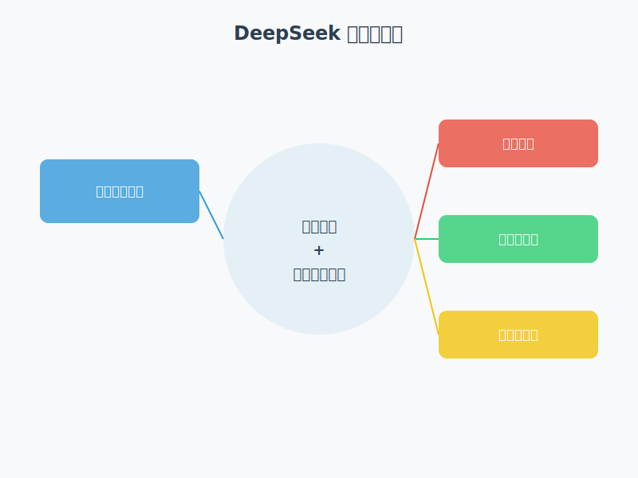

# 认识 DeepSeek：AI 领域的新星

在正式开始学习如何使用 DeepSeek 之前，让我们先来全面了解一下 DeepSeek 的背景、技术特点和市场定位。通过本文，你将清楚地认识到 DeepSeek 的发展历程、核心技术和独特优势。

## DeepSeek 的诞生与发展

### 成立背景

DeepSeek 的诞生可以追溯到中国量化投资公司幻方量化在人工智能领域的战略布局。2023 年 5 月，DeepSeek 从幻方量化中独立出来，并于同年 7 月 17 日正式成立，总部位于杭州。

公司的早期发展得益于两个重要优势：
1. **强大的资金支持**：早期研发资金由幻方量化直接出资
2. **充足的算力资源**：共享了幻方量化的"萤火超算"万卡级算力

### 战略定位

DeepSeek 以"技术民主化"为核心目标，致力于通过开源大语言模型推动人工智能的普惠化发展，打破西方技术垄断。为此，公司在成立初期即投入超过 5 亿美元用于采购 GPU，构建了坚实的算力基础设施。

## 技术演进之路

DeepSeek 在短时间内实现了多代模型的快速迭代：

1. **DeepSeek LLM**（2023 年 11 月）
   - 首个开源模型
   - 基于 LLaMA 的 Transformer 架构
   - 参数规模：6.7B 和 67B
   - 具备文本生成与对话能力

2. **DeepSeek-V2**（2024 年 5 月）
   - 第二代混合专家模型（MoE）
   - 性能对标 GPT-4 Turbo
   - 推理成本仅为 GPT-4 Turbo 的 1/70

3. **DeepSeek-V3**（2024 年 12 月）
   - 参数规模达到 671B
   - 超越 Qwen2.5-72B 和 Llama-3.1-405B
   - 接近 GPT-4o 和 Claude 3.5 的性能水平

4. **DeepSeek-R1**（2025 年 1 月）
   - 数学推理、代码生成等任务表现优异
   - 支持本地部署，增强隐私保护
   - 训练成本较 Claude 3.5 Sonnet 降低 90%

## DeepSeek 的核心竞争力

### 基础能力突破

DeepSeek 已经进入推理模型阶段，成功跻身全球第一梯队。其核心竞争力体现在以下几个方面：

1. **推理能力跃升**
   - DeepSeek 大模型核心技术突破
   - 实现复杂推理任务的精准处理与高效执行
   - 覆盖多模态场景应用

2. **国际竞争力指标**
   - 模型综合性能跃居全球第一梯队
   - 技术指标与国际顶尖水平（如 GPT系列、Claude等）直接对标
   - 奠定国产大模型的行业标杆地位

### 核心优势

DeepSeek 以"推理能力+第一梯队性能"为核心基础，重点发力三大方向：

1. **开源开放**
   - 技术共享，生态共建
   - 全量开源训练代码
   - 提供数据清洗工具及微调框架
   - 支持教育、金融、医疗等垂直领域应用
   - 推动社区协同创新

2. **低成本优势**
   - 普惠企业级AI应用
   - 大量的模型架构优化和系统工程优化
   - 训练成本仅$557w，显著低于行业同类模型
   - 推理成本降低83%，满足中小企业需求
   - 加速商业化落地

3. **国产化战略**
   - 技术自主，缩短差距
   - 将国产模型与美国的代际差距从3-5年缩短至3-5个月
   - 实现"弯道超车"技术抢跑
   - 构建多行业专属模型矩阵
   - 全面支持国内产业智能化升级

## 市场表现与突破

### 1. 应用端爆发

- **移动端应用**：2025 年 1 月 27 日，DeepSeek 应用登顶中国及美国区苹果 App Store 免费榜，下载量达到 1600 万次，增速超越同期 ChatGPT 下载量的 100%。

- **企业合作**：吸引了英伟达、亚马逊、微软等国际巨头，以及华为云、腾讯云等国内头部云服务商接入其模型。

### 2. 性能与成本优势

- DeepSeek-R1 在性能上与 GPT-4o mini 相当，但成本降低了 90%
- DeepSeek-V3 在 AGI 相关评测中展示了类人推理能力，支持物理模拟和创意生成

## 小结

DeepSeek 通过技术创新、开源开放和低成本战略，正在重塑全球AI技术格局。其在推理能力、性能表现和商业化落地等方面的突破，不仅推动了AI技术的普惠化发展，也为中国在全球AI竞争中赢得了重要优势。

在接下来的系列文章中，我们将深入探讨 DeepSeek 的具体使用方法、应用场景和高级技巧，敬请期待！

---

> 关注我们的小报童，获取更多 DeepSeek 相关资讯！ 

如果你对本节内容有疑问，欢迎添加我的微信 mjcoding（备注"小报童"），加入我们的「小报童专属学习群」，和更多AI爱好者一起互动学习！ 