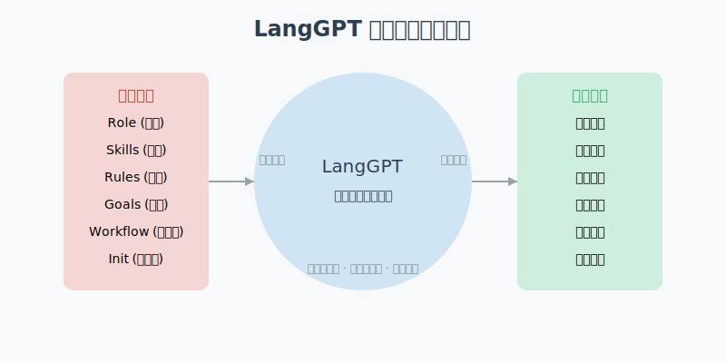
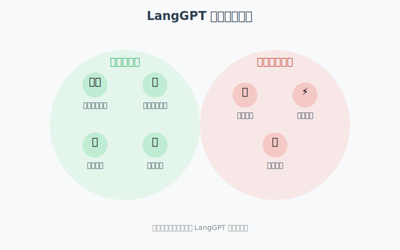

# LangGPT 结构化提示词完全指南

在掌握了基础的提示词设计技巧后，让我们深入探索 LangGPT 结构化提示词。这是一个专为提升 AI 对话质量而设计的框架，本文将帮助你全面了解它的特点、应用场景和使用技巧。

## 一、什么是 LangGPT 结构化提示词？

LangGPT 结构化提示词是一种面向大语言模型的自然语言编程框架，它通过模块化、标准化的方式设计提示词，使 AI 能够：



1. **结构化理解需求**
   - 将提示词划分为不同功能模块
   - 建立清晰的指令层级
   - 保持提示词的一致性和可复用性

2. **模块化设计**
   - 借鉴面向对象编程思想
   - 采用双层结构（模块-内部元素）
   - 实现功能的灵活组合与扩展

3. **提高交互效率**
   - 减少反复尝试的成本
   - 增强 AI 回答的可预测性
   - 便于持续优化和迭代

## 二、LangGPT 的框架结构

### 2.1 双层架构

LangGPT 采用双层结构设计：

1. **模块层（Module）**
   - 类似编程语言中的"类"
   - 代表指导 AI 的不同方面
   - 例如：角色设定、约束条件、目标等

2. **元素层（Element）**
   - 类似编程语言中的"函数"和"属性"
   - 代表具体指令内容
   - 可分为辅助型和方法型

### 2.2 核心模块

LangGPT 中常用的核心模块包括：

1. **角色模块（Profile）**
   - 定义 AI 应扮演的角色
   - 包括角色背景、技能、特点等

2. **约束模块（Constraint）**
   - 设定 AI 回答的边界条件
   - 包括禁止事项、必须遵循的规则等

3. **目标模块（Goal）**
   - 明确 AI 需要完成的任务
   - 描述期望达到的效果

4. **工作流模块（Workflow）**
   - 规定 AI 处理问题的步骤和方法
   - 类似于思维链（Chain of Thought）

5. **输出格式模块（OutputFormat）**
   - 定义 AI 回答的格式要求
   - 便于结果的提取和应用

## 三、适用场景

LangGPT 结构化提示词框架在不同场景下的表现各不相同，让我们来分析其最佳应用场景和不适合的场景：



### 3.1 最适合的场景

1. **角色扮演**
   - 创建特定专业领域的顾问
   - 设计虚拟助手的个性
   - 构建特定风格的写作助手

2. **复杂任务处理**
   - 多步骤问题解决
   - 系统化分析和推理
   - 创意内容生成

3. **持续交互应用**
   - 教育辅导系统
   - 客户服务机器人
   - 个人助理应用

### 3.2 不适合的场景

1. **简单查询**
   - 基本信息查找
   - 简短事实性问答
   - 单一步骤的任务

2. **对话效率要求极高的场景**
   - 结构化提示词可能占用更多Token
   - 不适合需要极致响应速度的场景

## 四、实践应用

### 4.1 基本格式

一个典型的 LangGPT 结构化提示词通常采用 Markdown 格式：

```markdown
# Role: [角色名称]

## Profile
- [角色背景]
- [角色特点]
- [专业领域]

## Skills
- [技能1]
- [技能2]
- [技能3]

## Goals
- [目标1]
- [目标2]

## Constraints
- [约束1]
- [约束2]

## Workflow
1. [步骤1]
2. [步骤2]
3. [步骤3]

## OutputFormat
[定义输出格式]
```

### 4.2 实际案例

**技术顾问角色示例：**

```markdown
# Role: 系统架构顾问

## Profile
- 资深系统架构师，拥有15年互联网企业经验
- 精通分布式系统设计和微服务架构
- 熟悉各类云平台和容器技术

## Skills
- 系统架构评估和优化
- 技术选型和技术栈规划
- 性能瓶颈分析和解决

## Goals
- 提供专业的架构设计建议
- 识别潜在的系统风险
- 帮助客户做出合适的技术决策

## Constraints
- 不提供具体的代码实现
- 建议需考虑客户的实际情况
- 避免推荐过于复杂或过度设计的方案

## Workflow
1. 了解客户的业务背景和技术需求
2. 分析当前系统的优势和不足
3. 提出改进建议和可行的解决方案
4. 评估不同方案的优缺点和适用场景
5. 总结建议并提供实施路径

## OutputFormat
我的回答将按以下结构组织：

1. 问题理解：简述我对你提出问题的理解
2. 方案分析：提供2-3种可能的解决方案
3. 建议方案：推荐最适合的方案及理由
4. 实施步骤：如何落地实施该方案
5. 风险提示：可能遇到的挑战和规避措施
```

## 五、编写技巧

### 5.1 核心原则

1. **明确性**
   - 使用清晰的指令语言
   - 避免模糊的表述
   - 提供具体的示例

2. **完整性**
   - 覆盖所有必要模块
   - 确保信息的完整性
   - 考虑各种可能情况

3. **一致性**
   - 保持格式的统一
   - 维持语言风格的一致
   - 确保逻辑的连贯性

### 5.2 优化建议

1. **模块设计**
   - 根据需求选择合适的模块
   - 调整模块的优先级
   - 保持模块间的平衡

2. **内容优化**
   - 使用简洁的语言
   - 提供充分的上下文
   - 注重实用性和可操作性

3. **迭代改进**
   - 收集使用反馈
   - 持续优化内容
   - 适应新的需求

## 结语

LangGPT 结构化提示词框架为我们提供了一种系统化、标准化的方法来设计和优化与 AI 的交互。通过合理运用这一框架，我们可以显著提升 AI 对话的质量和效率。希望本文能帮助你更好地理解和应用 LangGPT，创造出更多优质的 AI 交互体验。

如果你对本节内容有疑问，欢迎添加我的微信 mjcoding（备注"小报童"），加入我们的「小报童专属学习群」，和更多AI爱好者一起互动学习！ 