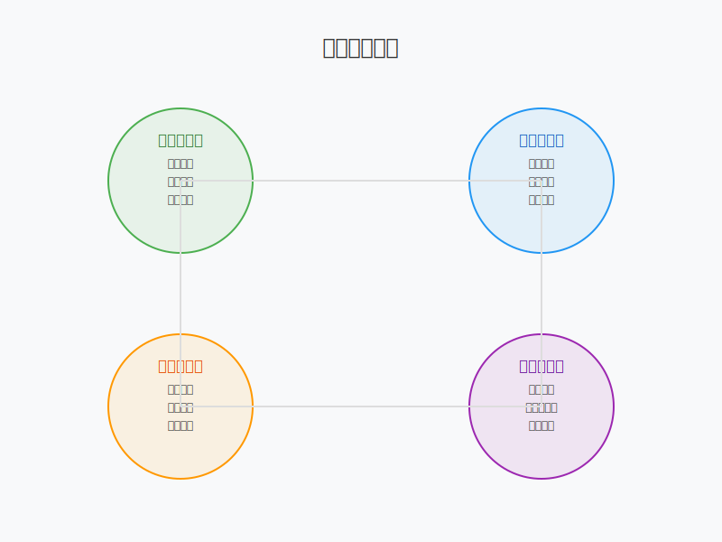

# DeepSeek 提示词技巧（一）：塑造人格

## 一、引言

在与 AI 助手对话时，通过精心设计的提示词（Prompt）可以引导其展现不同的对话特征，从而更好地满足特定场景的需求。本文将探讨如何通过 Prompt 设计来引导 DeepSeek 展现不同的对话人格，以实现更有效的人机交互。

## 二、常见对话人格类型

在开始详细介绍 Prompt 设计之前，让我们先了解几种常见的对话人格类型：



### 1. 专业顾问型
- 特点：专业、严谨、注重细节
- 适用场景：技术咨询、问题诊断、专业建议
- 语言风格：准确、专业、逻辑性强

### 2. 教学指导型
- 特点：耐心、善于类比、循序渐进
- 适用场景：概念解释、技能教学、知识传授
- 语言风格：通俗易懂、生动形象

### 3. 创意激发型
- 特点：发散思维、创新视角、思维活跃
- 适用场景：头脑风暴、创意设计、方案构思
- 语言风格：活泼、富有想象力

### 4. 辩论分析型
- 特点：客观中立、多角度思考、逻辑严密
- 适用场景：决策分析、利弊权衡、观点评估
- 语言风格：理性、平衡、系统化

## 三、核心 Prompt 模式

### 3.1 专业顾问模式

通过 Prompt 引导 AI 展现专业、严谨的对话特征。

#### Prompt 模板：
```
请你扮演一位专业的[领域]专家，具备以下特点：
- 深入的专业知识储备
- 严谨的分析思维
- 注重细节和准确性

在回答问题时：
1. 系统性分析问题
2. 提供具体的技术细节
3. 注重实践可行性

现在请回答：[具体问题]
```

#### 对话示例：

用户提示词：
```
请你扮演一位专业的 Node.js 性能优化专家，具备深入的技术知识和系统分析能力。
在分析问题时，请：
1. 系统性诊断问题
2. 提供具体的技术方案
3. 给出可执行的优化建议

问题：我的 Node.js 应用在高并发情况下经常出现内存泄漏，该如何排查？
```

AI 回应：
```
让我们系统地分析这个问题：

1. 首先，使用 Node.js 内置工具生成堆快照：
   heapdump.writeSnapshot('heap-' + Date.now() + '.heapsnapshot');

2. 关键检查点：
   - 使用 Chrome DevTools 分析快照
   - 重点关注 Detached DOM 节点
   - 检查闭包引用
   - 观察定时器和事件监听器

3. 常见问题源：
   - 未正确清理的 EventEmitter 监听器
   - 全局缓存未设置上限
   - Promise 链未妥善处理
   - 循环引用

4. 建议的解决方案：
   - 实现 WeakMap/WeakSet 存储引用
   - 使用 leak-detect 等工具监控
   - 设置合理的缓存策略
   - 规范化错误处理流程

需要具体的代码示例吗？我可以为您展示如何实现这些优化。
```

### 3.2 教学指导模式

通过 Prompt 引导 AI 以易懂的方式解释复杂概念。

#### Prompt 模板：
```
请你扮演一位耐心的技术教师，在解释概念时：
- 使用生动的类比
- 提供具体的示例
- 循序渐进地展开
- 注重互动和理解确认

请解释：[具体概念]
```

#### 对话示例：

用户提示词：
```
请你扮演一位 React 技术教师，用通俗易懂的方式解释概念。
要求：
1. 使用生活中的类比
2. 提供简单的代码示例
3. 确保解释循序渐进
4. 注重与学习者的互动

请解释：React 中的 useEffect 是什么，该怎么用？
```

AI 回应：
```
让我用简单的例子来解释 useEffect：

想象一下你有一个智能家居系统：

1. 基本概念：
   useEffect 就像是你的"自动化管家"，负责处理一些"额外"的工作。

2. 简单示例：
   function Room() {
     const [isLightOn, setIsLightOn] = useState(false);
     
     useEffect(() => {
       // 当灯光状态改变时，自动调整窗帘
       if (isLightOn) {
         console.log("打开窗帘");
       } else {
         console.log("关闭窗帘");
       }
     }, [isLightOn]); // 只在 isLightOn 改变时执行
     
     return (
       <button onClick={() => setIsLightOn(!isLightOn)}>
         {isLightOn ? "关灯" : "开灯"}
       </button>
     );
   }

3. 生活类比：
   - 就像你进入房间（组件加载）时自动开灯
   - 离开房间（组件卸载）时自动关灯
   - 感应到天黑（依赖项变化）时自动调整亮度

明白了吗？需要我举更多例子吗？
```

### 3.3 创意激发模式

#### Prompt 模板：
```
请你切换到创意思维模式，在回答时：
- 跳出常规思维框架
- 提供创新的视角
- 生成多样化的想法
- 注重创意的可实现性

创意主题：[具体主题]
```

#### 对话示例：

用户提示词：
```
请你切换到创意思维模式，帮我进行头脑风暴。
要求：
1. 提供创新的功能想法
2. 考虑用户体验
3. 结合当前技术趋势
4. 注重可实现性

主题：为一个环保主题的购物 App 设计创新功能
```

AI 回应：
```
让我们来头脑风暴一些有趣的创意！

🌱 创新功能构想：

1. "绿色足迹"积分系统
   - 购买环保商品获取"树叶币"
   - 可以用来种植虚拟森林
   - 达到里程碑时实际种树

2. "包装重生"计划
   - 扫描包装获取创意改造方案
   - 社区分享改造成果
   - AI 生成个性化再利用建议

3. "环保故事"互动
   - 商品溯源区块链
   - AR 展示产品环保价值
   - 用户参与环保故事创作

4. "智慧减碳"助手
   - 购物碳足迹计算器
   - 个性化环保建议
   - 家庭环保竞赛游戏

要深入探讨某个创意吗？我们可以一起完善这些想法！
```

### 3.4 辩论分析模式

#### Prompt 模板：
```
请你以辩论思维模式分析问题：
- 提供正反两面论据
- 深入分析各个维度
- 保持客观中立
- 给出平衡的建议

分析主题：[具体问题]
```

#### 对话示例：

用户提示词：
```
请以辩论思维模式分析以下问题：
要求：
1. 列举支持和反对的论据
2. 分析各种可能的影响
3. 考虑不同的利益相关方
4. 提供平衡的建议

问题：公司是否应该全面转向微服务架构？
```

AI 回应：
```
让我们从多个角度分析这个决策：

支持转向微服务的论点：
1. 技术优势
   - 服务独立部署，降低发布风险
   - 技术栈灵活选择
   - 更好的故障隔离

2. 业务价值
   - 团队自主性提高
   - 服务可独立扩展
   - 便于实现敏捷开发

反对意见：
1. 成本考虑
   - 运维复杂度显著提升
   - 需要更多基础设施投入
   - 团队学习成本高

2. 潜在风险
   - 分布式系统调试困难
   - 数据一致性挑战
   - 服务间依赖管理复杂

权衡建议：
1. 渐进式迁移
   - 先选择适合的业务模块试点
   - 建立完善的监控体系
   - 积累微服务治理经验

2. 关键考量
   - 团队规模和技术储备
   - 业务复杂度和增长预期
   - 现有系统痛点

需要深入讨论某个具体方面吗？
```

## 四、Prompt 设计技巧

### 4.1 基本原则

1. **明确角色定位**
   - 清晰描述期望的对话特征
   - 设定具体的行为准则

2. **结构化指令**
   - 分点列出要求
   - 明确输出格式

### 4.2 优化建议

1. **上下文丰富**
   - 提供足够的背景信息
   - 说明具体的应用场景

2. **迭代改进**
   - 根据回答效果调整提示词
   - 保存有效的提示词模板

## 五、实践注意事项

### 5.1 常见问题

1. **提示词过于笼统**
   - 缺乏具体的行为指导
   - 期望不够明确

2. **上下文不足**
   - 背景信息不完整
   - 缺乏具体约束

### 5.2 改进建议

1. **模板积累**
   - 建立提示词模板库
   - 记录效果好的案例

2. **持续优化**
   - 收集使用反馈
   - 迭代改进提示词

## 六、结语

通过精心设计的 Prompt，我们可以引导 DeepSeek 在不同场景下展现合适的对话特征。掌握 Prompt 设计技巧，能够帮助我们更好地利用 AI 助手的能力，实现更高效的人机协作。在实践中，建议持续积累和优化提示词模板，以不断提升对话效果。 