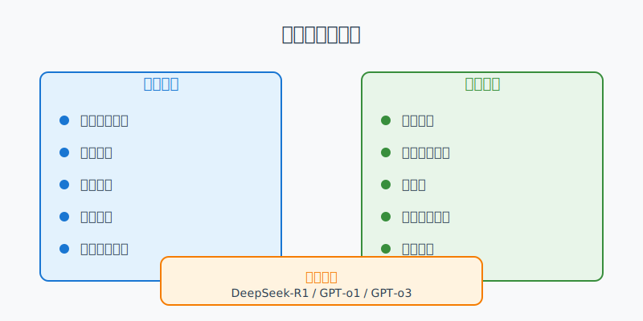

# DeepSeek 提示词进阶：推理模型与通用模型

在人工智能领域，大语言模型可以分为推理模型和非推理模型两大类。本文将深入介绍这两类模型的特点和应用场景，帮助你更好地选择和使用 DeepSeek。

## 一、推理大模型



### 1.1 什么是推理大模型？
推理大模型是指能够在传统的大语言模型基础上，强化推理、逻辑分析和决策能力的模型。它们通常具备额外的技术，比如强化学习、神经符号推理、元学习等，来增强其推理和问题解决能力。

### 1.2 代表模型
- DeepSeek-R1
- GPT-o1/o3

这些模型在逻辑推理、数学推理和实时问题解决方面表现突出。

### 1.3 优势领域
1. **核心能力**
   - 数学推导
   - 逻辑分析
   - 代码生成
   - 复杂问题拆解

2. **性能特点**
   - 专精于逻辑密度高的任务
   - 并非全面更强，仅在特定训练目标领域显著优于通用模型

### 1.4 适用场景
- 数学证明
- 算法设计
- 代码生成
- 复杂问题诊断

## 二、非推理大模型（通用模型）


### 2.1 模型特点
通用模型一般侧重于语言生成、上下文理解和自然语言处理，而不强调深度推理能力。此类模型通常通过对大量文本数据的训练，掌握语言规则并能够生成合适的内容。

### 2.2 代表模型
- DeepSeek V3
- GPT-3、GPT-4（OpenAI）
- BERT（Google）

这些模型主要用于：
- 语言生成
- 语言理解
- 文本分类
- 翻译等任务

### 2.3 优势领域
1. **核心优势**
   - 文本生成
   - 创意写作
   - 多轮对话
   - 开放性问答

2. **性能特点**
   - 擅长多样性任务
   - 需要严格逻辑链条的任务表现较弱

## 三、快思慢想：效能兼顾 全局视野


### 3.1 概率预测（快速反应模型）
1. **性能表现**
   - 响应速度快
   - 算力成本低

2. **运作原理**
   - 基于概率预测
   - 通过大量数据训练来快速预测可能的答案

3. **局限性**
   - 限于模式识别和优化
   - 缺乏真正的创新能力
   - 较难理解复杂情感和意图

### 3.2 链式推理（慢速思考模型）
1. **性能表现**
   - 慢速思考
   - 算力成本高

2. **运作原理**
   - 基于链式思维（Chain-of-Thought）
   - 逐步推理问题的每个步骤来得到答案

3. **优势特点**
   - 能够自主分析情况，实时做出决策
   - 具备创新能力
   - 更自然地与人互动
   - 能够处理多维度和非结构化问题

## 四、场景实践与提示词策略

### 4.1 数学推理与证明

1. **推理模型示例**
```
直接提问：
请证明：对于任意正整数n，n^2 + n 是偶数。

或简单追加思路引导：
请证明：对于任意正整数n，n^2 + n 是偶数。
提示：可以考虑n的奇偶性。
```

2. **通用模型示例**
```
详细引导：
请帮我证明：对于任意正整数n，n^2 + n 是偶数。
请按以下步骤思考：
1. 先分类讨论n的奇偶性
2. 分别讨论n为奇数和偶数的情况
3. 得出结论

示例：让我们以n=2和n=3为例子验证...
```

### 4.2 代码生成与调试

1. **推理模型示例**
```
直接需求：
用Python实现一个二分查找算法，要求处理好边界情况。

或简单补充：
用Python实现一个二分查找算法，需要：
- 处理边界情况
- 返回目标值索引
- 目标值不存在时返回-1
```

2. **通用模型示例**
```
详细引导：
请用Python实现一个二分查找算法，要求如下：
1. 输入：有序数组nums和目标值target
2. 输出：如果找到target返回其索引，否则返回-1
3. 需要处理的边界情况：
   - 数组为空
   - 目标值不在数组范围内
   - 有重复元素时返回第一个匹配位置
4. 请先写出函数签名
5. 然后实现主要逻辑
6. 最后加上测试用例
```

### 4.3 创意写作与内容生成

1. **推理模型示例**
```
直接创作：
请以"未来城市"为主题写一篇800字的科幻小说。

或简单引导：
请写一篇800字的科幻小说：
- 主题：未来城市
- 视角：第一人称
- 风格：悬疑
```

2. **通用模型示例**
```
详细引导：
请以"未来城市"为主题写一篇科幻小说，要求：
1. 字数：800字左右
2. 结构：
   - 开头：描绘未来城市的标志性场景
   - 发展：引入一个科技带来的矛盾
   - 高潮：展现人与科技的冲突
   - 结尾：给出启示或思考
3. 写作要点：
   - 使用第一人称视角
   - 加入2-3个未来科技元素
   - 突出悬疑氛围
4. 参考开头：
   "我站在第394层的悬浮阳台上，看着无人机群穿梭于霓虹交错的天际线..."
```

### 4.4 多轮对话与问答

1. **推理模型示例**
```
角色设定：
你是一位资深的Python开发者，请帮我解答一些问题。

或简单引导：
作为一位Python专家，请帮我：
1. 解答代码问题
2. 提供最佳实践建议
3. 分享性能优化技巧
```

2. **通用模型示例**
```
详细引导：
请你扮演一位资深Python开发者，我们将进行多轮对话。要求：
1. 回答要包含：
   - 直接解决方案
   - 相关知识解释
   - 最佳实践建议
2. 如果我的问题不清晰，请主动提问澄清
3. 使用代码示例来解释概念
4. 每次回答后，主动询问是否需要更多解释

示例问答：
Q: Python中的装饰器是什么？
A: 让我通过一个简单的例子来解释...
```

### 4.5 数据分析与可视化

1. **推理模型示例**
```
直接需求：
分析这份销售数据，找出关键趋势和异常。

或简单引导：
请分析销售数据：
1. 计算基础统计指标
2. 识别异常值
3. 生成可视化图表
```

2. **通用模型示例**
```
详细引导：
请帮我分析这份销售数据，按以下步骤进行：
1. 数据预处理：
   - 检查缺失值
   - 处理异常值
   - 格式化日期字段
2. 基础统计分析：
   - 计算每月销售额
   - 统计产品类别分布
   - 识别销售峰值
3. 可视化要求：
   - 使用折线图显示趋势
   - 使用饼图展示分布
   - 使用箱线图检测异常
4. 输出格式：
   - 数据摘要
   - 关键发现
   - 建议行动
```

### 4.6 文本翻译与本地化

1. **推理模型示例**
```
直接翻译：
将以下文本翻译成中文，保持专业术语准确性。

或简单引导：
翻译以下文本：
- 目标语言：中文
- 保持专业术语
- 适应中文表达习惯
```

2. **通用模型示例**
```
详细引导：
请将以下文本翻译成中文，要求：
1. 翻译原则：
   - 忠实原文含义
   - 符合中文表达习惯
   - 保持专业术语准确性
2. 处理要点：
   - 专业术语对照表（请提供）
   - 文化差异适配
   - 语境本地化
3. 输出格式：
   - 原文/译文对照
   - 术语注解
   - 翻译说明
4. 如遇模糊处，请：
   - 标注可能的多种译法
   - 解释选择依据
```

## 结语

选择合适的模型和提示词策略对于获得理想的输出结果至关重要。推理模型通常可以用更简洁的提示词，而通用模型则需要更详细的引导。在实践中，建议：

1. 先判断任务类型，选择合适的模型
2. 根据模型特点，调整提示词详细程度
3. 在实际应用中不断优化和调整提示词
4. 保存效果好的提示词模板，便于复用

如果你对本节内容有疑问，欢迎添加我的微信 mjcoding（备注"小报童"），加入我们的「小报童专属学习群」，和更多AI爱好者一起互动学习！ 