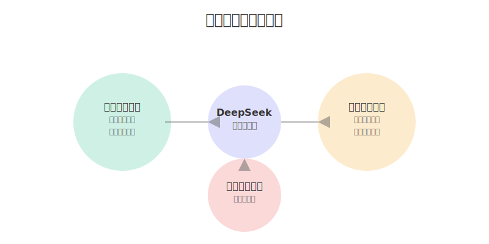

# DeepSeek 提示词技巧（二）预言家模式

在使用 DeepSeek 进行对话时，预言家模式是一个非常强大的提示词技巧。通过合理运用这个模式，我们可以让 AI 不仅回答当前问题，还能主动预测潜在问题和未来需求，从而获得更全面、更有价值的回答。让我们深入了解如何在 DeepSeek 中运用这个强大的提示词技巧。

## 预言家模式的核心原理

预言家模式的精髓在于通过特定的提示词引导 DeepSeek "提前思考，主动预测"。这不是简单的问答，而是通过精心设计的提示词，激发 AI 的预测能力。这种模式建立在三个基本原则之上：



### 主动预测问题

在设计提示词时，我们可以引导 DeepSeek 主动分析潜在问题：

示例提示词：
```
在分析这个问题时，请：
1. 预测可能遇到的主要障碍
2. 识别潜在的风险点
3. 提供初步的解决方案
```

这样的提示词能让 AI 超越简单回答，提供更有前瞻性的分析。

### 延伸需求预测

通过适当的提示词，引导 DeepSeek 预测用户的潜在需求：

示例提示词：
```
除了回答当前问题，请同时：
1. 分析可能的延伸需求
2. 预测未来的使用场景
3. 提供迭代优化建议
```

这种提示方式能获得更全面的解决方案。

### 情景模拟引导

使用特定提示词让 DeepSeek 模拟不同场景：

示例提示词：
```
请模拟以下三种情况：
1. 最理想情况会如何发展？
2. 最坏情况可能是什么？
3. 最可能发生的情况是什么？
并分别提供应对建议。
```

## 实战应用技巧

### 商业分析提示词

在进行商业分析时，可以使用以下提示词模板：

1. 市场分析
```
请分析这个商业计划：
1. 预测未来 6-12 个月的市场变化
2. 识别潜在的竞争威胁
3. 提供应对策略建议
```

2. 风险评估
```
对于这个项目：
1. 列出可能的风险点
2. 评估每个风险的影响程度
3. 提供具体的规避方案
```

### 产品设计提示词

在产品设计过程中，可以使用这些提示词：

1. 需求预测
```
在设计这个功能时：
1. 预测用户可能的使用场景
2. 分析潜在的痛点
3. 提供功能迭代建议
```

2. 用户体验
```
请从用户角度：
1. 预测可能的使用困难
2. 识别体验优化点
3. 提供改进建议
```

### 技术方案提示词

针对技术方案，可以使用如下提示词：

1. 架构设计
```
在设计这个系统时：
1. 预测可能的扩展需求
2. 识别潜在的性能瓶颈
3. 提供优化建议
```

2. 实现细节
```
关于这个功能的实现：
1. 预判可能的技术难点
2. 评估维护成本
3. 提供具体的实现方案
```

## 实际案例演示

让我们通过一个实际案例，来看看如何运用预言家模式的提示词：

### 案例：设计一个 AI 写作助手

提示词示例：
```
我正在设计一个 AI 写作助手，请：
1. 预测用户可能的使用场景和需求
2. 识别潜在的技术和产品风险
3. 提供分阶段的实现建议
4. 预判可能的竞品策略
5. 设计应对方案
```

DeepSeek 的回答将包含：
1. 场景预测
   - 文章创作辅助
   - 内容优化建议
   - 多语言翻译
   - 风格转换

2. 风险分析
   - 内容原创性问题
   - 语言质量把控
   - 用户隐私保护
   - 版权合规风险

3. 实现路径
   - 基础写作功能
   - 高级语言模型
   - 个性化定制
   - 协作功能

### 提示词优化建议

1. 明确预测范围
   - 设定具体的时间跨度
   - 指定关注的维度
   - 限定场景范围

2. 结构化输出
   - 要求分类展示
   - 设定优先级
   - 要求具体量化

3. 迭代优化
   - 要求持续跟进
   - 设置检验标准
   - 预留调整空间


## 总结

预言家模式是 DeepSeek 提示词技巧中的一个重要组成部分。通过合理运用这些提示词技巧，我们可以充分发挥 AI 的预测能力，获得更有价值的分析和建议。在实践中，建议根据具体场景和需求，灵活调整和组合这些提示词模板，以获得最佳效果。

---
作者：孟健
微信：mjcoding
欢迎加入我们的学习交流群，一起探讨 DeepSeek 的无限可能！ 