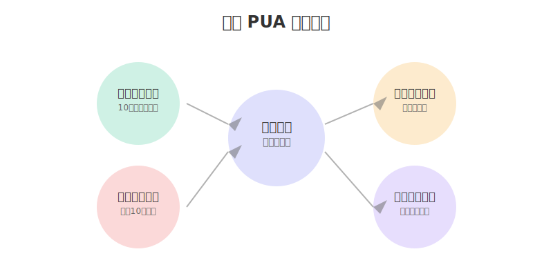

# DeepSeek 提示词技巧（三）杠精模式

在使用 DeepSeek 的过程中，我们经常需要它帮我们发现问题、提供建议。这时候就需要激活它的"杠精模式"，通过批判性思维来全面审视问题，提供建设性的反馈。

## 什么是杠精模式？

杠精模式是一种基于批判性思维的提示策略，它能帮助我们：
- 全面审视问题的各个方面
- 发现潜在的风险和缺陷
- 提供具体可行的改进建议
- 系统化地优化解决方案


如上图所示，杠精模式包含四个核心特点：全面审视、严格标准、建设性反馈和优先级管理。这些特点共同构成了一个完整的批判性思维框架。

## 杠精模式的最佳实践：反向 PUA

杠精模式最典型的应用就是"反向 PUA"策略。这种方法不是简单的否定和批评，而是通过特定的提示词技巧，激发 DeepSeek 的批判性思维和创造力。



反向 PUA 继承了杠精模式的核心特点，通过"挑战"和"质疑"的方式，来：
1. 激发更深层次的思考
2. 引导多维度分析
3. 促使给出更完善的方案

### 三个关键提示词模板

#### 1. 列举反对理由
```
请你列出10个反对这个方案的理由，并针对每个理由提供改进建议：
1. [理由1] -> [改进方案]
2. [理由2] -> [改进方案]
...
```

这个模板能帮助我们：
- 全面发现方案中的潜在问题
- 获得具体的改进建议
- 提升方案的完整性

#### 2. 角色代入批评
```
如果你是[特定角色]（比如：行业专家/竞争对手/挑剔用户），
你会如何批评这个方案？请从以下几个方面进行分析：
1. 技术可行性
2. 市场竞争力
3. 用户体验
4. 成本效益
```

这种方式可以：
- 获得不同视角的评估
- 发现专业层面的问题
- 预见潜在的市场反应

#### 3. 复盘优化循环
```
这个回答你满意吗？请至少复盘10轮，每一轮都要：
1. 指出当前答案的不足
2. 提供具体的改进方向
3. 给出优化后的版本
```

通过这个模板：
- 促使 DeepSeek 不断优化答案
- 获得更深入的分析
- 达到最优解决方案

## 实战应用案例

让我们看一个产品设计的实例：

### 初始提示词：
```
我们计划开发一款智能家居控制系统，主要功能包括：
1. 设备远程控制
2. 场景智能联动
3. 能耗管理分析
请你评估这个方案。
```

### 使用杠精模式的反向 PUA 技巧：
```
1. 请列出10个这个智能家居系统可能失败的理由
2. 假设你是一个资深黑客，如何攻破这个系统？
3. 从用户隐私保护的角度，这个方案有哪些致命问题？
```

通过这种方式，我们可能得到：

1. 安全隐患分析
   - 设备认证机制不足
   - 数据传输加密不够
   - 权限管理存在漏洞

2. 用户体验问题
   - 配置流程过于复杂
   - 场景联动不够智能
   - 离线模式不完善

3. 系统架构缺陷
   - 扩展性受限
   - 兼容性问题
   - 性能瓶颈

## 进阶使用技巧

### 1. 层层深入
```
第一轮：列出基础问题
第二轮：深入每个问题的细节
第三轮：提供具体的解决方案
```

### 2. 多维度质疑
```
从以下维度提出质疑：
1. 技术实现难度
2. 市场接受程度
3. 运营维护成本
4. 商业模式可行性
```

### 3. 极限场景测试
```
请设想以下极端情况：
1. 系统大规模故障
2. 恶意用户攻击
3. 数据泄露事件
4. 市场竞争加剧
```

## 注意事项

1. 保持建设性
   - 批评要有依据
   - 建议要可执行
   - 保持积极导向

2. 控制反馈强度
   - 避免过度否定
   - 注重实际可行性
   - 循序渐进改进

3. 关注核心问题
   - 抓住主要矛盾
   - 优先解决关键点
   - 循环优化提升

## 总结

杠精模式不是为了单纯的否定和批评，而是通过批判性思维和反向 PUA 技巧，帮助我们：
- 发现问题的盲点
- 获得更深入的分析
- 达到更优的解决方案

记住，好的杠精不是为了找茬，而是为了让方案变得更加完善和可靠。

---
作者：孟健
微信：mjcoding
欢迎加入我们的学习交流群，一起探索 DeepSeek 的无限可能！ 