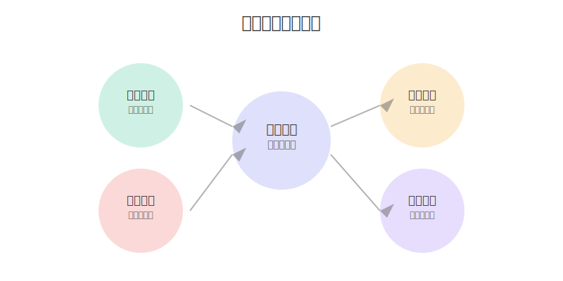

# DeepSeek 提示词技巧（四）善于模仿

在使用 DeepSeek 写文章时，如果仅仅使用提示词约束，效果可能一般。但如果你给它一篇范文或者让它模仿某种语气，DeepSeek 往往能精准地抓住要点，写出符合你期望的内容。

## 为什么要使用模仿策略？

模仿策略的优势在于：
- 能快速理解你想要的风格和标准
- 更容易保持一致的语气和调性
- 提高输出内容的质量和准确性
- 减少反复修改和调整的成本



## 三种实用的模仿技巧

### 1. 风格模仿
```
请用以下风格写一篇关于[主题]的文章：
[插入一段你喜欢的范文]

要求：
1. 保持相同的行文节奏
2. 使用类似的表达方式
3. 维持一致的情感基调
```

这种方法适合：
- 写有特定风格要求的文章
- 需要保持统一语气的系列内容
- 模仿某个作者或品牌的写作风格

### 2. 结构模仿
```
这是一篇[类型]文章的结构示例：
[插入范文的结构框架]

请按照这个结构，写一篇关于[新主题]的文章，
要求：
1. 保持相同的段落组织方式
2. 使用类似的论述逻辑
3. 对应相同的内容层次
```

特别适用于：
- 写技术文档或说明书
- 产品介绍或使用手册
- 学术论文或研究报告

### 3. 语气模仿
```
以下是目标语气的示例：
[插入几个典型的语气示例]

请用这种语气，回答以下问题：
[具体问题或主题]

注意：
1. 保持一致的用语习惯
2. 模仿说话的节奏和语调
3. 使用相似的表达方式
```

常见应用：
- 客服对话脚本
- 品牌营销文案
- 社交媒体互动

## 实战案例：技术博客写作

### 原始需求：
```
请写一篇关于 Docker 容器技术的入门文章
```

### 使用模仿策略：
```
这是一篇深受欢迎的技术博客示例：
[插入一篇优质技术博客]

请参考这篇文章的写作风格，写一篇 Docker 入门教程，需要：
1. 保持相同的讲解深度
2. 使用类似的类比和举例
3. 采用相同的内容组织方式
```

## 进阶应用技巧

### 1. 多层次模仿
```
第一层：整体结构
第二层：段落组织
第三层：句式表达
第四层：用词选择
```

### 2. 融合创新
```
模仿要点：
1. 提取核心特征
2. 保留精华部分
3. 加入个性元素
4. 创造新的表达
```

### 3. 场景适配
```
根据不同场景：
1. 正式场合：学术/商务风格
2. 社交平台：轻松/活泼风格
3. 技术文档：严谨/清晰风格
4. 营销文案：吸引/感染力强
```

## 注意事项

1. 避免过度模仿
   - 保持内容的原创性
   - 不要完全照搬表达
   - 融入自己的见解

2. 选择合适范例
   - 与目标主题相关
   - 质量有保证
   - 风格适合需求

3. 灵活变通
   - 根据实际需求调整
   - 不拘泥于固定模式
   - 保持创作的灵活性

## 总结

模仿策略是提升 DeepSeek 输出质量的有效方法。通过合理运用模仿技巧，我们可以：
- 快速达到预期效果
- 保持内容的一致性
- 提高创作的效率

记住，好的模仿不是简单的复制，而是要在理解和吸收的基础上，创造出新的价值。

---
作者：孟健
微信：mjcoding
欢迎加入我们的学习交流群，一起探索 DeepSeek 的无限可能！ 