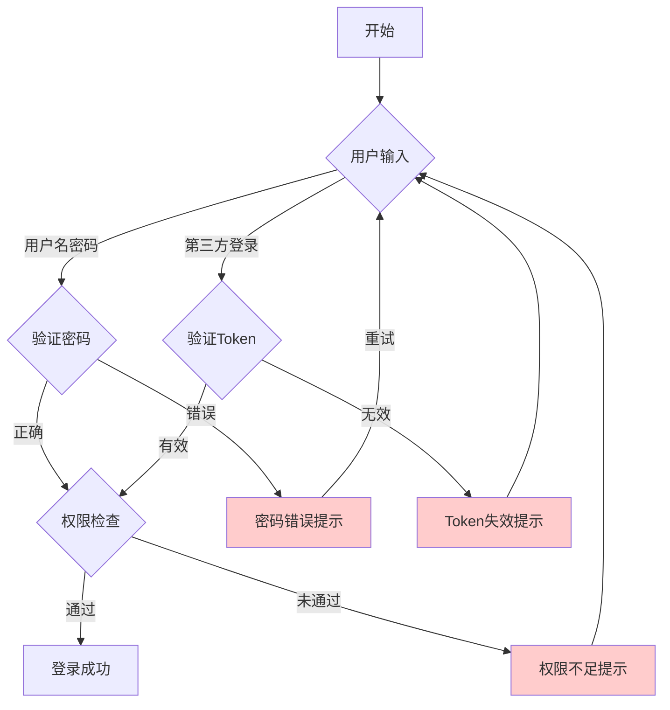

# DeepSeek 实战职场提效篇（三）专业流程图

在日常工作中，我们经常需要制作各种流程图来表达业务逻辑、系统架构或工作流程。本文将介绍如何结合 DeepSeek 和 Draw.io 来快速制作专业级的流程图。

## 一、Mermaid代码+Draw.io组合（专业级流程图）

### 1.1 生成 Mermaid 代码

在 DeepSeek 中，我们可以使用以下模板指令来生成流程图代码：

```
生成一个[XX系统/场景]的Mermaid流程图，包含[关键步骤]，用不同颜色标注异常分支，输出可直接渲染的代码
```

例如，我们可以这样描述需求：
> 生成用户登录流程图，包含密码验证、权限查询分支，用红色标注错误路径

DeepSeek 会自动生成符合 Mermaid 语法的代码。这些代码可以表达：
- 多层级流程（如二级权限判断）
- 复杂的条件分支
- 异常处理路径
- 并行流程

### 1.2 在 Draw.io 中可视化

生成代码后，我们可以在 Draw.io 中将其转换为美观的流程图：

1. 访问 [Draw.io 官网](https://app.diagrams.net/)
2. 创建新文件
3. 点击菜单栏「插入 → 高级 → Mermaid」
4. 粘贴 DeepSeek 生成的代码
5. 点击「插入」即可生成图表

### 1.3 优化和导出

Draw.io 提供了丰富的优化和导出选项：

1. 图表类型支持（17种）：
   - 流程图（Flowchart）
   - 时序图（Sequence Diagram）
   - 甘特图（Gantt Chart）
   - 状态图（State Diagram）
   - 类图（Class Diagram）
   - 实体关系图（ER Diagram）
   - 思维导图（Mind Map）
   - 等等...

2. 自定义样式：
   - 节点颜色和形状
   - 连接线样式（实线、虚线、箭头等）
   - 布局方向（横向/纵向）
   - 字体和大小

3. 导出格式：
   - PNG（适合插入文档）
   - SVG（可缩放矢量图）
   - PDF（打印友好）
   - URL（在线分享）

## 二、最佳实践

1. **合理分层**
   - 将复杂流程分解为多个子流程
   - 使用子图（subgraph）组织相关节点
   - 保持每层逻辑清晰

2. **视觉优化**
   - 使用一致的配色方案
   - 为关键节点添加醒目标注
   - 保持适当的节点间距

3. **注释和文档**
   - 为复杂分支添加说明
   - 使用注释说明特殊情况
   - 导出时保留源代码

## 三、示例

以下是一个用户登录流程的示例代码：



## 四、总结

通过结合 DeepSeek 的智能代码生成和 Draw.io 的专业绘图能力，我们可以快速制作出美观、专业的流程图。这不仅提高了工作效率，也确保了流程图的质量和可维护性。

建议在实际工作中：
1. 先用自然语言描述流程
2. 使用 DeepSeek 生成初始代码
3. 在 Draw.io 中进行可视化和优化
4. 导出合适格式并妥善保存

这样的工作流程既保证了效率，又确保了专业性。 