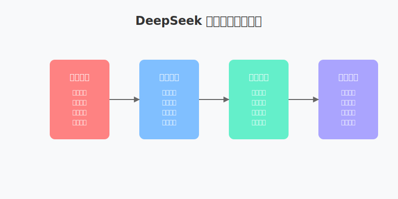

# DeepSeek 实战商业应用篇（四）视频制作

在短视频时代，如何快速高效地制作优质内容成为了每个创作者和企业的重要课题。本文将探讨如何利用 DeepSeek 的能力来提升视频制作效率，特别是在爆款内容创作方面的应用。

## 视频脚本创作的核心要素

根据北京大学的研究，一个成功的短视频脚本需要融合以下几个关键要素：

1. 热点基因库：收集和分析当前流行的话题和内容形式
2. 数据化镜头设计：基于数据分析的镜头语言和视觉效果
3. 平台特调适配：根据不同平台的特点调整内容策略
4. 变现路径预埋：合理设计商业变现点

## DeepSeek 在视频制作中的应用



### 1. 前期策划

DeepSeek 可以帮助创作者进行以下工作：

- 热点话题分析和挖掘
- 目标受众画像描绘
- 内容框架设计
- 变现点策划

提示词示例：
```
分析目标：美妆产品短视频策划
prompt: "请帮我分析当前美妆领域的热门话题和爆款视频特点，重点关注：
1. 近期热门妆容趋势
2. 18-25岁女性用户的兴趣偏好
3. 竞品爆款视频的共同特征
4. 适合植入的变现场景
输出一份详细的内容企划建议。"
```

### 2. 脚本撰写

利用 DeepSeek 的强大语言能力，可以：

- 生成符合平台调性的文案
- 设计吸引人的开场白
- 编写富有节奏感的对话
- 优化结尾和互动设计

提示词示例：
```
任务：口红试色视频脚本
prompt: "请为一款新上市的哑光口红编写15秒短视频脚本，要求：
1. 开场3秒吸引眼球
2. 突出'超级哑光'和'持久不掉色'两大卖点
3. 设计2个互动引导点
4. 符合抖音平台调性
请给出分镜脚本和文案。"
```

### 3. 镜头设计

DeepSeek 能够提供：

- 场景转换建议
- 镜头语言设计
- 视觉效果规划
- 转场方式推荐

提示词示例：
```
场景：美食制作过程
prompt: "为一道咖喱饭制作视频设计镜头语言，需要：
1. 3-4个核心镜头角度建议
2. 食材特写的拍摄参数
3. 沸腾、炒制等动态场景的拍摄技巧
4. 2-3个创意转场方案
注重质感展现和美食诱惑力。"
```

### 4. 后期优化

在视频制作完成后，DeepSeek 还可以协助：

- 标题优化
- 封面设计建议
- 字幕生成
- 发布时间建议

提示词示例：
```
目标：视频发布优化
prompt: "这是一个美食vlog视频，主题是'15分钟学会咖喱饭'，请：
1. 生成10个标题供选择，考虑SEO和点击率
2. 设计3个封面方案，包括构图和文案建议
3. 生成全程字幕，加入表情和特效建议
4. 分析最佳发布时间段，提供发布策略"
```

## 实战案例：爆款视频脚本设计

以下是一个使用 DeepSeek 辅助创作的视频脚本示例：

```markdown
| 镜头 | 时间 | 内容 | 备注 |
|------|------|------|------|
| 1 | 00:00-00:03 | 女主（直面镜头）："你也在为xx烦恼吗？" | 引发共鸣 |
| 2 | 00:03-00:06 | AI画外音："<br>"点击的瞬准"" | 吸引注意力 |
| 3 | 00:06-00:09 | 女主："直击痛点xx"<br> | 产品卖点展示 |
```

## 效果提升技巧

1. 使用【🔥】标记热点话题
2. 采用分镜技术展示产品
3. 设置互动引导和悬念
4. 优化发布时机

## 注意事项

1. 确保内容真实可信
2. 避免过度营销
3. 遵守平台规则
4. 保护用户隐私

## 总结

DeepSeek 在视频制作领域展现出了强大的辅助能力，特别是在内容策划和脚本创作方面。通过合理运用这些功能，创作者可以显著提升视频制作效率和质量。

## 参考资料

1. 北京大学商业创新研究
2. DeepSeek 官方文档
3. 短视频创作指南 